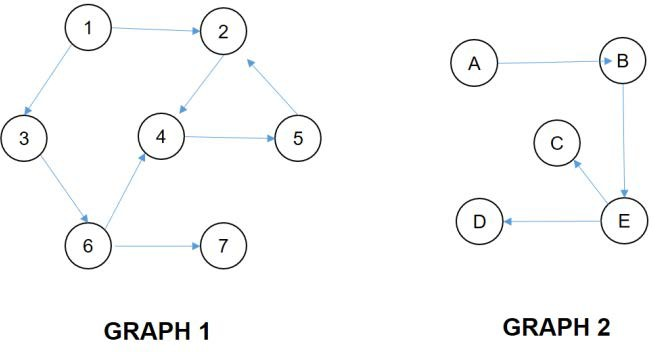

# Graph-Implementation

Create a program that allows you to perform the depth first search/traversal as well as the breadth first search/traversal on the following graphs:

Those are your program's predefined graphs. Your program should display the following menu:
* [1]	Perform Depth First Traversal
* [2]	Perform Breadth Fist Traversal
* [3]	Search Graph 1(DFS)
* [4]	Search Graph 2(BFS)
* [5]	Exit

1.	When the user chooses [1], the user is asked which graph he or she wants to traverse. The program then prints out the final order in which the nodes are visited using the Depth First Traversal.
2.	When the user chooses [2], the user is asked which graph he or she wants to traverse. The program then prints out the final order in which the nodes are visited using the Breadth First Traversal.
3.	Choosing [3] searches for the vertex inputted by the user. Use the DFS on Graph 1 and print a message if the vertex is not part of the graph.
4.	Choosing [4] searches for the vertex inputted by the user. Use the BFS on Graph 2 and print a message if the vertex is not part of the graph.
5.	Keep on displaying the menu until the user chooses [5].
6.	Implement the graph using an adjacency matrix*.
 

*IMPORTANT: Use your own array implementation for this, not a built in class.
